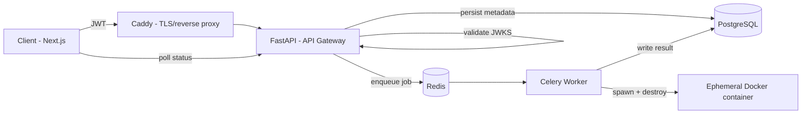

# OopsEngine

Distributed remote code execution service. Users submit untrusted code, OopsEngine runs it in an isolated, resource-capped Docker container and streams back the result.

The core problem this solves: **you cannot run arbitrary user-submitted code in your API process.** OopsEngine separates "accept the request" from "run the code" using a message queue, so a slow or malicious submission never blocks the API and never touches the host directly.


---

## Architecture



1. **Client (Next.js)** submits code with a JWT, then polls an endpoint for job status (`QUEUED → RUNNING → SUCCESS/ERROR`). This is polling, not a websocket/SSE stream — good enough for the current latency budget, called out here so nobody's surprised reading the code.
2. **Caddy** terminates TLS (auto Let's Encrypt) and reverse-proxies to the API.
3. **FastAPI gateway** verifies the JWT against a JWKS endpoint, writes job metadata to Postgres, and pushes the payload onto a Redis queue. It never executes anything itself.
4. **Redis** is the queue between the stateless API and the workers.
5. **Celery worker** pulls a job, spins up a throwaway Docker container via the Docker SDK, runs the code inside it under resource limits, captures stdout/stderr/exit code, tears the container down, and writes the result back.

---

## Sandboxing model

This is the part that actually matters for an RCE service, so it gets its own section instead of a bullet point.

- **One container per job.** Containers are created fresh and destroyed after execution — no reuse, no shared filesystem state between submissions.
- **Resource limits enforced at the container level:** CPU shares, memory ceiling, and a hard execution timeout are set via the Docker SDK (`docker/client.py`), not left to the guest process to self-regulate.
- **No network access** inside the execution container by default (`--network none`), so submitted code can't exfiltrate data or call out.
- **Non-root execution** inside the container.

What this setup does **not** yet do, stated plainly instead of hidden: no seccomp/AppArmor custom profile beyond Docker defaults, no gVisor/Kata-style hardened runtime isolation. Docker-in-Docker is good isolation, not kernel-level isolation — if you're planning to run this against genuinely hostile input at scale, that's the next hardening step, not a solved problem.

---

## Tech stack

| Layer | Tech |
|---|---|
| Frontend | Next.js, React, Tailwind CSS |
| API | FastAPI, Python 3.10 |
| Task queue | Celery + Redis |
| Database | PostgreSQL (AsyncPG) |
| Auth | Clerk (JWT / JWKS) |
| Sandboxing | Docker SDK, Docker-in-Docker |
| Infra | Docker Compose, Caddy, Azure Ubuntu VM |

---

## Running locally

**Prerequisites:** Docker + Docker Compose. A Postgres client is optional, for poking at the DB directly.

```bash
git clone https://github.com/yansh07/OopsEngine.git
cd OopsEngine/backend
```

Create `backend/.env`:

```env
# Database
POSTGRES_USER=postgres
POSTGRES_PASSWORD=yourpassword
POSTGRES_DB=oopsengine

# Auth
CLERK_JWKS_URL=your_jwks_url_here

# Queue
REDIS_URL=redis://redis:6379/0

# Worker limits (adjust to host capacity)
CONTAINER_CPU_LIMIT=0.5
CONTAINER_MEMORY_LIMIT=256m
CONTAINER_TIMEOUT_SECONDS=10
```

Build and run everything:

```bash
docker compose up --build -d
```

Initialize the database schema:

```bash
docker exec -it oopsengine_api python init_db.py
```

API is now live at `http://localhost:8000`. Interactive docs at `http://localhost:8000/docs`.

---

## Known limitations / roadmap

- Polling-based status updates — SSE or websockets would cut latency and load.
- Isolation relies on stock Docker, not a hardened runtime — see [Sandboxing model](#sandboxing-model).
- No horizontal worker autoscaling yet; Celery concurrency is set statically.
- No language/runtime plugin system — supported languages are hardcoded in the worker image.

## License

MIT — see [LICENSE](LICENSE).
